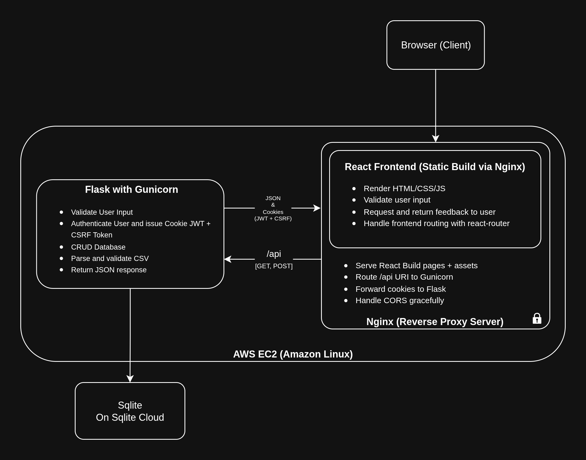

# Result Management System (CS50x Final Project)

A exam evaluation and result management system that streamlines examiner assignments, test grading, and student report card distribution.

---

## 🚀 Motivation

Throughout CS50x we wrote code that was specific to a data structure, language, or algorithm. While solving a problem was rewarding, it often felt incomplete—what was missing was the *final product*: a deployable application. Toward the end of the course, assignments got closer to this goal, but there was still a level of hand-holding.

David Malan (an amazing teacher!) often talked about "removing the training wheels"—and that is exactly what this project is about. I wanted to build something from scratch and take it all the way to deployment.

---

## 💡 Ideation

With the basics covered in CS50x, I knew I wanted to create a web application. A few ideas came to mind:

- A blog or portfolio site (but I don’t write much - Need to change that :D)
- A planner app (like Trello, but too ambitious)

Eventually, the idea came from a conversation with my father (a CS professor), whose college was looking for a way to digitize exam records. It felt doable for a solo developer to build a proof-of-concept.

---

## 🎯 Final Goals

- Handle real-world roles: Examination Supervisor, Examiner, Student
- Enable CSV upload to generate user and exam records
- Build a scalable frontend using React
- Build a RESTful API using Flask + Gunicorn
- Store and query persistent data on SQLite Cloud
- Deploy the full app on AWS EC2

---

## 🧑‍💻 About the App

### 🔗 Working Demo Video

_Not hosted publicly due to academic reasons. Fully functional on private EC2 instance._

### 🗺️ System Architecture

The diagram illustrates the interaction between Flask, React, Nginx, and SQLite Cloud on AWS EC2, detailing request flows and component responsibilities.

### 🧱 Features

- Role-based access control: Admin, Examiner, Student
- Upload CSV files to auto-create users and course mappings
- JWT + CSRF-secured login and API access
- Client-side validation and interactive UI via React
- CRUD operations on SQLite Cloud database via API
- Fully deployed app on AWS EC2 using Nginx and Gunicorn

---

## 🏗️ Tech Stack and Tools

### Flask with Gunicorn
- Built RESTful API endpoints to handle login, CSV upload, and CRUD operations.
- Used `sqlitecloud` SDK to perform database operations.
- Validated user input using regular expressions.
- Parsed and validated CSV files using `csv.DictReader`.
- Deployed using Gunicorn for multi-worker support and improved performance.

### Bootstrap
- Used Bootstrap grid system for responsive design.
- Styled HTML to maintain consistency across different screen sizes.

### ~~Jinja2~~
- Initially used server-side rendering with Flask + Jinja.
- Switched to React due to difficulty adding DOM interactivity using Jinja inline Python.

### React
- Switched to React for clean, modular frontend logic.
- `react-router-dom` used for in-app page routing.
- Form validation done on client-side for UX and error prevention.

### Flask-JWT-Extended
- Used JSON Web Tokens (JWT) for stateless authentication.
- Tokens stored in `HttpOnly` cookies for security against XSS attacks.
- Combined JWT with CSRF token for additional request validation.

### flask-cors
- Enabled CORS headers to allow secure cross-origin requests from React frontend.

### Sqlite Cloud
- Persistent cloud-hosted SQL database.
- `sqlitecloud` Python module mirrored the syntax of `sqlite3`, requiring no changes to app logic.

### Nginx (Reverse Proxy)
- Served React static files and routed `/api` requests to Gunicorn.
- Handled SSL termination and cookie forwarding.
- Solved CORS issues post-build which weren't visible during development with Vite.

### AWS EC2
- Hosted the app on an Amazon Linux instance.
- Replicated development environment on the cloud using SSH and SCP.
- Used persistent volumes to preserve app state even when instance is shut down.

---

## 🧠 Reflections

This project was one of the most rewarding experiences of my CS50x journey. It challenged me to connect all the dots: from authentication to deployment, from routing to input validation. I now understand what it really takes to ship an app end-to-end—and this is just the beginning.

---

## 📚 Learnings

- Gained deep understanding of JWTs, CSRF protection, and secure cookie storage.
- Understood how reverse proxy servers work and configured Nginx manually.
- Learned the importance of frontend-backend separation and CORS.
- Learned how to deploy, debug, and persist services on AWS EC2.

---

Made with ❤️ by Anshuman for CS50x Final Project.